<!--
==============================================================================
CINEMATIC CYBER INVESTIGATION -> IDENTITY REVEAL -> CHESS ENDGAME
SUBJECT: MAANAS SRI UDBHAV MADDULA (@UdbhavMaddula)
==============================================================================
-->

  <!-- 01. INTERROGATION ROOM / SURVEILLANCE BOOT -->
  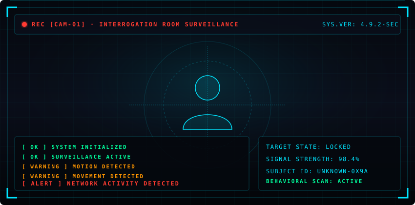

 

  
<b>[ SYS LOG ] VIEW RAW TELEMETRY &amp; PERIMETER MOTION DATA</b>

   
  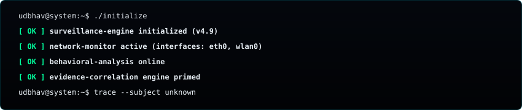

 

  <!-- 02. UNKNOWN SUBJECT TELEMETRY -->
  

    

  <!-- 03. SOC MULTI-FEED SURVEILLANCE -->
  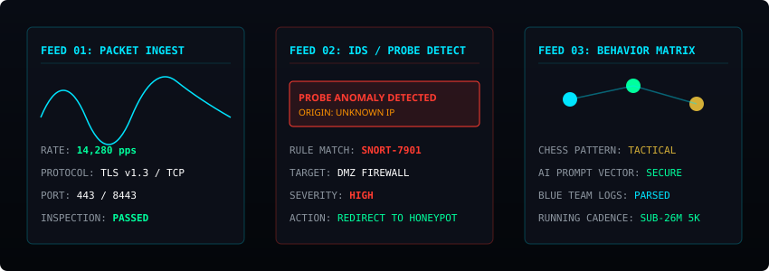

    

  <!-- 04. NETWORK TRACE -->
  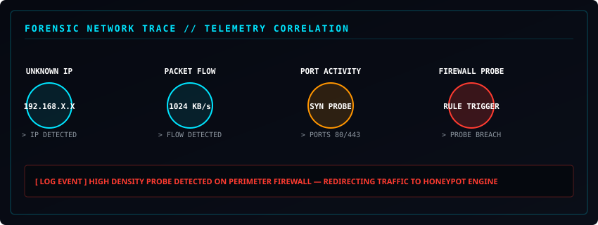

    

  <!-- 05. FIREWALL BREACH ALERT -->
  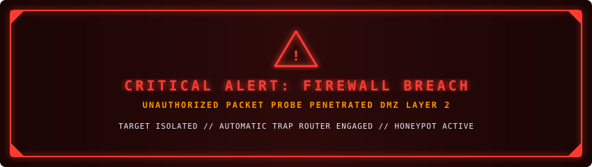

    

  <!-- 06. HONEYPOT TRAP TRIGGER -->
  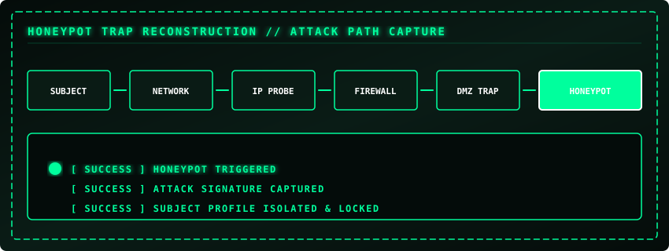

 

  
<b>[ FORENSIC INGEST ] VIEW HONEYPOT PACKET CAPTURE SNIPPET</b>

   
  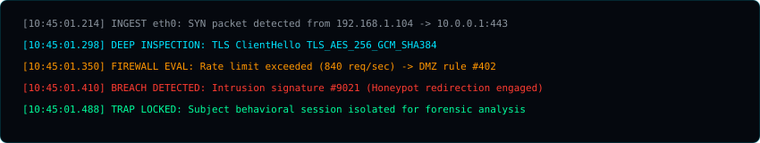

 

  <!-- 07. EVIDENCE CORRELATION ENGINE -->
  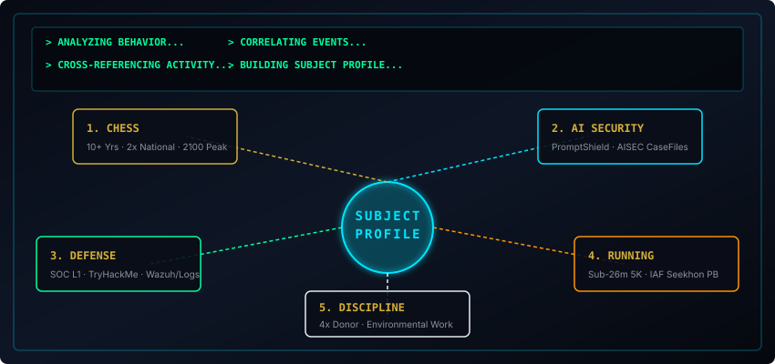

 

  
<b>[ CORRELATION MATRIX ] VIEW CAPTURED BEHAVIORAL SIGNATURES</b>

   
  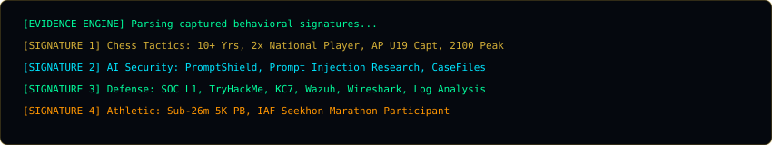

 

  <!-- 08. IDENTITY RESOLUTION TICKER -->
  

    

  <!-- 09. TERMINAL WHOAMI -->
  

    

  <!-- 10. MAIN IDENTITY REVEAL -->
  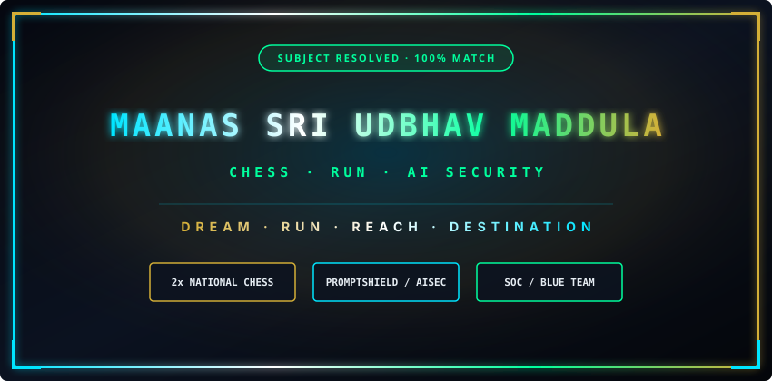

    

  <!-- 11. CHESSBOARD ENDGAME TRANSITION & NAVIGATION MATRIX -->
  
  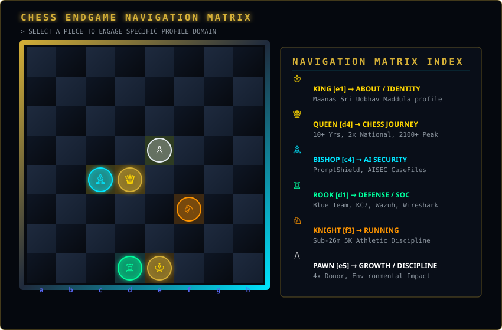

 

---

### ♟️ CHESS ENDGAME NAVIGATION MATRIX INDEX

| Piece | Domain | Navigation Target | Overview / Highlights |
| :---: | :--- | :--- | :--- |
|  | **KING** | [`#king`](#king) | **Identity & Core Profile**: Maanas Sri Udbhav Maddula |
|  | **QUEEN** | [`#chess`](#chess) | **Chess Mastery**: 10+ Yrs, 2x National, Former AP Captain, 2100+ Peak |
|  | **BISHOP** | [`#ai-security`](#ai-security) | **AI Security Research**: PromptShield, AISEC CaseFiles |
|  | **ROOK** | [`#defense`](#defense) | **Defense & Blue Team**: SOC L1, TryHackMe, KC7, Wazuh, Wireshark |
|  | **KNIGHT** | [`#running`](#running) | **Athletic Endurance**: Sub-26m 5K PB, IAF Seekhon Marathon |
|  | **PAWN** | [`#growth`](#growth) | **Growth & Discipline**: 4x Blood Donor, Environmental Work |

---

 

<!-- ========================================================================= -->
<!-- DOMAIN ANCHOR HEADERS (PHASE 2 DEEPDIVES PREPARATION)                     -->
<!-- ========================================================================= -->

## 01 — ♟️ CHESS DOMAIN
> *10+ Years Experience · 2× National Player · Former Andhra Pradesh U19 Captain · Vice Captain CU North Zone*

## 02 — 🛡️ AI SECURITY DOMAIN
> *AI Security Learning & Research · PromptShield · Prompt Injection Research · AISEC CaseFiles*

## 03 — ⚔️ DEFENSE / BLUE TEAM DOMAIN
> *SOC Level 1 · TryHackMe · KC7 · Network & Phishing Forensic Log Analysis*

## 04 — 🏃 RUNNING DOMAIN
> *Consistency & Athletic Endurance · Sub-26-Minute 5K Personal Best · Seekhon IAF Marathon*

## 05 — 🌱 GROWTH & DISCIPLINE DOMAIN
> *Pawn Mindset · 4 Blood Donations in 1.5 Years · Environmental Impact Participation*

---

  SYSTEM RESOLUTION ENGINE v1.0 · OPERATED BY UDBHAV MADDULA

