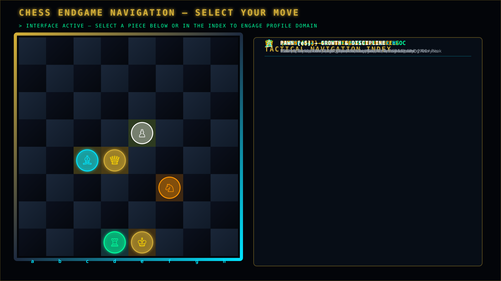

<!--
==============================================================================
CINEMATIC CYBER INVESTIGATION -> IDENTITY REVEAL -> CHESS ENDGAME
SUBJECT: MAANAS SRI UDBHAV MADDULA (@UdbhavMaddula)
==============================================================================
-->

  <!-- FIRST SCREEN / PRIMARY CINEMATIC INVESTIGATION CONSOLE -->
  

 

---

### ♟️ CHESS ENDGAME NAVIGATION

> **CASE CLOSED // NEW INTERFACE LOADED**  
> *SELECT YOUR MOVE BELOW TO ENGAGE SPECIFIC PROFILE DOMAIN*

 

  
  

 

| Piece | Domain | Navigation Target | Overview / Highlights |
| :---: | :--- | :--- | :--- |
| ♔ | **KING** | [`#identity`](#identity) | **Identity & Core Profile**: Maanas Sri Udbhav Maddula |
| ♕ | **QUEEN** | [`#chess`](#chess) | **Chess Mastery**: 10+ Yrs, 2x National, Team AP Captain, North Zone Leader |
| ♗ | **BISHOP** | [`#ai-security`](#ai-security) | **AI Security Research**: PromptShield, Prompt Injection Detection |
| ♖ | **ROOK** | [`#defense`](#defense) | **Defense / Blue Team**: SOC L1, TryHackMe, KC7, Wazuh, Wireshark |
| ♘ | **KNIGHT** | [`#running`](#running) | **Athletic Endurance**: Sub-26m 5K PB, IAF Seekhon Marathon |
| ♙ | **PAWN** | [`#growth`](#growth) | **Growth & Discipline**: 4x Voluntary Blood Donor, Environmental Work |

---

 

<!-- ========================================================================= -->
<!-- PROFILE CONTENT SECTIONS                                                  -->
<!-- ========================================================================= -->

## 01 — 👑 IDENTITY & CORE PROFILE
> *Maanas Sri Udbhav Maddula (Preferred: Udbhav) · B.E. CSE — Cybersecurity, Chandigarh University*

- **Full Name**: Maanas Sri Udbhav Maddula
- **Preferred Name**: Udbhav
- **Education**: B.E. Computer Science Engineering (Cybersecurity specialization), Chandigarh University
- **Core Pillars**: Cybersecurity, AI Security, Digital Forensics, Blue Team / SOC, Chess, Athletic Endurance Running

---

## 02 — ♟️ CHESS DOMAIN
> *10+ Years Experience · 2× National Player · Former Andhra Pradesh U19 Captain · Vice Captain CU North Zone*

- **Experience**: 10+ years competitive chess player & tournament strategist.
- **National Representation**: 2× National Chess Player representing Andhra Pradesh & Chandigarh University.
- **State Leadership**: Former Andhra Pradesh U19 Chess Captain, U19 State Runner-Up.
- **Inter-University Leadership**: Vice Captain — Chandigarh University North Zone team at AIU North Zone Championship (35 universities, 6 rounds, 4/6 score, 26th individual rank, 11th team rank).
- **CU Chess Challenge**: Winner — CU Chess Challenge 2025.
- **Rating Benchmark**: 2100+ Chess.com peak reference.

---

## 03 — 🛡️ AI SECURITY DOMAIN
> *LLM Vulnerability Research · PromptShield · Prompt Injection Detection · AISEC CaseFiles*

- **Research Focus**: Large Language Model guardrails, adversarial prompt injection vectors, system prompt isolation, and AI security posture analysis.
- **PromptShield**: Conceptual defensive toolkit for verifying prompt boundary safety and preventing jailbreaks.
- **AISEC CaseFiles**: Forensic security analysis reports and case studies on AI model exploits, indirect prompt injection, and defensive system design.

---

## 04 — ⚔️ DEFENSE / BLUE TEAM / SOC DOMAIN
> *SOC Level 1 · TryHackMe · KC7 Cyber Labs · Log Analysis & Threat Hunting*

- **Blue Team Focus**: Security Operations Center (SOC) Level 1 analyst workflows, log ingestion, threat hunting, and incident triage.
- **Platforms**: TryHackMe, KC7 Cyber labs, OSINT investigation modules.
- **Tooling Stack**: Wireshark, Nmap, tcpdump, Snort, Wazuh, KQL (Kusto Query Language), Sysmon, MITRE ATT&CK framework mapping.
- **Forensic Operations**: Network packet dissection, phishing email header analysis, Windows event log auditing.

---

## 05 — 🏃 RUNNING DOMAIN
> *Consistency & Athletic Endurance · Sub-26-Minute 5K PB · Seekhon IAF Marathon*

- **Athletic Philosophy**: Running as a daily practice of mental grit, physical discipline, and unyielding consistency.
- **Personal Best**: Sub-26-minute 5K personal record.
- **Marathon Events**: 5K Seekhon IAF Marathon participant & distance runner.

---

## 06 — 🌱 GROWTH & DISCIPLINE DOMAIN
> *Pawn Mindset · 4 Blood Donations in 1.5 Years · Community & Environmental Impact*

- **Pawn Philosophy**: Small, disciplined daily moves compound into queen-level strategic impact.
- **Social Impact**: 4 voluntary blood donations in approximately 1.5 years.
- **Community Action**: Active participant in environmental cleaning drives and sustainability initiatives.
- **Official Recognition**: Special appreciation from Chandigarh University Sports Director, Registrar, HOD/Hostel Management, and Government of Andhra Pradesh.

---

  INTELLIGENCE RESOLUTION ENGINE v3.0 · OPERATED BY MAANAS SRI UDBHAV MADDULA

