<!--
==============================================================================
CINEMATIC CYBER INVESTIGATION -> IDENTITY REVEAL -> CHESS ENDGAME
SUBJECT: MAANAS SRI UDBHAV MADDULA (@UdbhavMaddula)
==============================================================================
-->

  <!-- 01. SINGLE PRIMARY CINEMATIC INVESTIGATION EXPERIENCE -->
  

 

> **SYSTEM INTERFACE ONLINE**  
> *SELECT A CHESS PIECE BELOW TO ENGAGE PROFILE DOMAIN*

 

  <!-- 02. CHESS ENDGAME NAVIGATION MATRIX -->
  
  

 

---

### ♟️ CHESS ENDGAME NAVIGATION MATRIX INDEX

| Piece | Domain | Navigation Target | Overview / Highlights |
| :---: | :--- | :--- | :--- |
|  | **KING** | [`#king`](#king) | **Identity & Core Profile**: Maanas Sri Udbhav Maddula |
|  | **QUEEN** | [`#chess`](#chess) | **Chess Mastery**: 10+ Yrs, 2x National, Former AP Captain, 2100+ Peak |
|  | **BISHOP** | [`#ai-security`](#ai-security) | **AI Security Research**: PromptShield, AISEC CaseFiles |
|  | **ROOK** | [`#defense`](#defense) | **Defense & Blue Team**: SOC L1, TryHackMe, KC7, Wazuh, Wireshark |
|  | **KNIGHT** | [`#running`](#running) | **Athletic Endurance**: Sub-26m 5K PB, IAF Seekhon Marathon |
|  | **PAWN** | [`#growth`](#growth) | **Growth & Discipline**: 4x Blood Donor, Environmental Work |

---

 

<!-- ========================================================================= -->
<!-- DOMAIN PROFILE SECTIONS                                                   -->
<!-- ========================================================================= -->

## 01 — ♟️ CHESS DOMAIN
> *10+ Years Experience · 2× National Player · Former Andhra Pradesh U19 Captain · Vice Captain CU North Zone*

- **Experience**: 10+ years competitive chess player & strategist.
- **National Level**: 2× National Chess Player representing Andhra Pradesh & Chandigarh University.
- **Leadership**: Former Andhra Pradesh U19 Chess Captain, U19 State Runner-Up.
- **Inter-University Championship**: Vice Captain — Chandigarh University North Zone team at AIU North Zone Championship (35 universities, 6 rounds, 4/6 score, 26th individual rank, 11th team rank).
- **Winner**: CU Chess Challenge 2025 Winner.
- **Peak Rating**: 2100+ Chess.com peak.

---

## 02 — 🛡️ AI SECURITY DOMAIN
> *AI Security Learning & Research · PromptShield · Prompt Injection Research · AISEC CaseFiles*

- **Research Focus**: Vulnerability analysis of Large Language Models, Prompt Injection vector analysis, and defensive guardrails.
- **PromptShield**: Conceptual framework and defense tools for LLM system prompt integrity.
- **AISEC CaseFiles**: In-depth security analysis and case studies on AI model exploits, adversarial prompt attacks, and mitigation design.

---

## 03 — ⚔️ DEFENSE / BLUE TEAM DOMAIN
> *SOC Level 1 · TryHackMe · KC7 · Network & Phishing Forensic Log Analysis*

- **Specialization**: Security Operations Center (SOC) Level 1 analyst workflows, threat hunting, and incident detection.
- **Platforms & Cyber Exercises**: TryHackMe, KC7 Cyber labs, OSINT investigation modules.
- **Security Tooling**: Wireshark, Nmap, tcpdump, Snort, Wazuh, KQL (Kusto Query Language), Sysmon, MITRE ATT&CK framework mapping.
- **Forensic Expertise**: Log analysis, phishing header breakdown, network traffic dissection.

---

## 04 — 🏃 RUNNING DOMAIN
> *Consistency & Athletic Endurance · Sub-26-Minute 5K Personal Best · Seekhon IAF Marathon*

- **Athletic Discipline**: Running as a core driver of mental endurance, daily consistency, and physical grit.
- **Personal Best**: Sub-26-minute 5K personal record.
- **Events**: Participant in 5K Seekhon IAF Marathon and competitive distance events.

---

## 05 — 🌱 GROWTH & DISCIPLINE DOMAIN
> *Pawn Mindset · 4 Blood Donations in 1.5 Years · Environmental Impact Participation*

- **Pawn Philosophy**: Constant forward progress; small, relentless daily moves compound into queen-level impact.
- **Social Impact**: 4 voluntary blood donations in approximately 1.5 years.
- **Community Contribution**: Participation in environmental cleaning drives and sustainability initiatives.
- **Official Recognition**: Special appreciation from Chandigarh University Sports Director, Registrar, HOD/Hostel Management, and Government of Andhra Pradesh.

---

  SYSTEM RESOLUTION ENGINE v2.0 · OPERATED BY MAANAS SRI UDBHAV MADDULA

